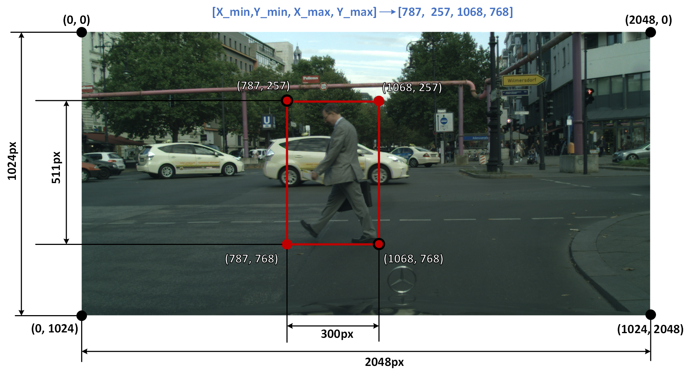

# Fairness-Testing-of-Autonomous-Driving-Systems

Welcome to the online appendix for the paper entitled "Bias Behind the Wheel: Fairness Testing of Autonomous Driving Systems". Here, we provide supplementary materials including raw results,  datasets and sensitive attributes labels, Python code for the analysis process, and scripts to replicate our experiments.

## Datasets

In this directory, we present the datasets utilized in our experiments. The "datasets" directory is organized around three aspects: the four testing datasets used in RQ1 (overall), the partitioned datasets in each scenario (partitioned) in RQ2, and all images containing ground-truth person labels (used for partitioning in RQ2). The directory structure is as follows (numbers in parentheses indicate the number of images in each folder):

```
datasets
|
|-- image_person
|   |-- image_person(#5,933)
|-- overall
|   |-- citypersons(#1,525)
|   |-- ecp_day (#2,427)
|   |-- ecp_night (#2,126)
|   |-- bdd100k (#2,233)
|-- partitioned
    |-- brightness
    |   |-- day and night
    |		|-- day(#4,409), night(#1,524)
    |-- contrast
    |   |-- five contrast levels
    |    	|-- level1(#1,163), level2(#3,933), level3(#837)
    |-- weather
        |-- rainy(#277)
        |-- non-rainy(#3,800)
```

All the datasets can be downloaded from the google drive link with aforementioned structure:
https://drive.google.com/drive/folders/17jwRiQ-Oum60ZUN_l2tlw2adce0Ej3gX?usp=sharing

The four benchmark testing datasets used in our experiments, as described in <u>Section 3.3.1</u>. The datasets are detailed in "*Table 2: Benchmark Datasets*" in our academic paper, providing information on the number of images and the time of capture for each dataset. 

In addition,  we also provide the partitioned datasets from the scenario labeling discussed in <u>Section 3.3.3</u>. The scripts used to partition these datasets into three contrast levels are located in the "evaluation/scripts" directory.  RQ2 focuses on real-world key scenarios, each having its respective sub-folder: brightness, contrast, and weather. Detailed information is presented in "*Table 5: Number of images in different brightness levels, contrast levels, and weather conditions*."


## Labels

In the "labels" directory, we provide the labels used in our experiments. This folder is divided into two main sections. The first section contains the labels for RQ1: Overall Fairness, located in the "RQ1_overall" sub-directory. It includes ground-truth labels and predicted labels for the four testing datasets, organized according to the datasets. The second section covers the labels for RQ2: Fairness in Different Scenarios, found in the "RQ2_partitioned" sub-directory. These labels are categorized based on the fine-grained scenarios we discussed.

This directory can also be downloaded in the provided google drive link:
https://drive.google.com/drive/folders/1VbrgYa1tCZraGBs0cfZmiSY23gle5GAv?usp=sharing

### 1. RQ1 Overall Fairness (RQ1_overall)

The "labels" folder is structured as follows. The "GT" subdirectory contains ground-truth labels for each of the four testing datasets: "bdd100k," "citypersons," "eurocity_day," and "eurocity_night". Within this directory, the labels are further categorized based on their attributes and stored in corresponding sub-folders.

Similarly, the "DT" subdirectory is organized according to the four testing datasets: "bdd100k," "citypersons," "eurocity_day," and "eurocity_night." It contains predicted labels from eight pedestrian detectors for each dataset. The predicted labels are stored in sub-folders named after the respective detectors, such as "yolox," "retinanet," "faster rcnn," "cascade rcnn," "alfnet," "prnet," "csp," and "mgan." Each detector has 10 inference results, corresponding to "results_0" through "results_9."

```
RQ1_overall
|
|-- GT
|   |-- bdd100k
|   |   |-- gender, age, skin
|   |-- citypersons
|   |   |-- gender, age
|   |-- ecp_day
|   |   |-- gender, age
|   |-- ecp_night
|       |-- gender, age
|-- DT
    |-- bdd100k
    |   |-- yolox (results_0-results_9)
    |   |-- retinanet (results_0-results_9)
    |   |-- faster rcnn (results_0-results_9)
    |   |-- cascade rcnn (results_0-results_9)
    |   |-- alfnet (results_0-results_9)
    |   |-- prnet (results_0-results_9)
    |   |-- csp (results_0-results_9)
    |   |-- mgan (results_0-results_9)
    |-- citypersons
    |   |-- yolox (results_0-results_9)
    |   |-- retinanet (results_0-results_9)
    |   |-- faster rcnn (results_0-results_9)
    |   |-- cascade rcnn (results_0-results_9)
    |   |-- alfnet (results_0-results_9)
    |   |-- prnet (results_0-results_9)
    |   |-- csp (results_0-results_9)
    |   |-- mgan (results_0-results_9)
    |-- ecp_day
    |   |-- yolox (results_0-results_9)
    |   |-- retinanet (results_0-results_9)
    |   |-- faster rcnn (results_0-results_9)
    |   |-- cascade rcnn (results_0-results_9)
    |   |-- alfnet (results_0-results_9)
    |   |-- prnet (results_0-results_9)
    |   |-- csp (results_0-results_9)
    |   |-- mgan (results_0-results_9)
    |-- ecp_night
    |   |-- yolox (results_0-results_9)
    |   |-- retinanet (results_0-results_9)
    |   |-- faster rcnn (results_0-results_9)
    |   |-- cascade rcnn (results_0-results_9)
    |   |-- alfnet (results_0-results_9)
    |   |-- prnet (results_0-results_9)
    |   |-- csp (results_0-results_9)
    |   |-- mgan (results_0-results_9)
```

The GT and DT format is explained as follows:

**(1) GT  (Ground-Truth Labels)**

The "GT" directory contains ground-truth labels for each dataset, as detailed in "*Table 4: Number of labeled pedestrian instances per dataset.*" in our academic paper. We provide formulated skin tone, age and gender labels on all four testing datasets. 

Each image's ground truth label is stored in a separate TXT file within the corresponding attribute's folder. For example, in the "cp" dataset, the gender label for the image `berlin_000003_000019_leftImg8bit.png` can be found in the file `berlin_000003_000019_leftImg8bit.txt` within the `./evaluation/labels/RQ1_overall/GT/citypersons/gender/` directory. Each TXT file can contain labels for multiple individuals present in the image.

The manual labeling process was performed using LabelImg, with the original format being in YOLO format. We have formulated each label's format in a more precise way, the formulated GT label for each person is represented using a *five-digit format*, taking gender as an example:

`gender X_min Y_min X_max Y_max`

Here, "gender" denotes the gender classification, where 0 represents male and 1 represents female. For other attributes, such as skin tone (0 for light-skin, 1 for dark-skin), and age (0 for adult, 1 for child), similar conventions apply.

The values X_min, Y_min, X_max, and Y_max are used to describe the *bounding box* of the target object:

- `X_min` and `Y_min`: The coordinates of the **top-left corner** of the bounding box.

- `X_max` and `Y_max`: The coordinates of the **bottom-right corner** of the bounding box.

Our bounding boxes start at the point (`X_min`, `Y_min`) and end at the point (`X_max`, `Y_max`). Let's consider one of the sample images as an example:



The final label for the middle person is: 

`0 (male) 787 257 (top-left corner) 1068 768 (bottom-right corner)`

**(2) DT (Detected Labels/Predicted Labels)**

The detected labels refer to the prediction information made by the 8 pedestrian detectors on the locations of "predicted person" in the four testing datasets. For each image's inference result, there is a corresponding TXT file. Within each TXT file, the organization format for the prediction result of a person is represented in a five-digit format, as follows:

`confidence_score X_min Y_min X_max Y_max`

Confidence_score represents the probability assigned by the pedestrian detector to the prediction, indicating the level of certainty that the detector has in its prediction. To ensure the reliability of the predictions, we retain only those predictions with a confidence score higher than 50%. 

`X_min`, `Y_min`, `X_max`, and `Y_max` carry the same meaning as in the GT. They denote the coordinates of the bounding box enclosing the predicted person, where `X_min` and `Y_min` correspond to the top-left corner, and `X_max` and `Y_max` correspond to the bottom-right corner of the bounding box.

### 2. RQ2 Fairness in Different Scenarios (RQ2_partitioned)

In this section, we present the classified and structured label information for RQ2 - Fairness in Different Scenarios ("RQ2_partitioned" directory). The labels has been categorized based on the classified dataset in "Dataset" part explained in the previous dataset introduction. The directory structure is as follows:

```
RQ2_partitioned
|
|-- brightness
|   |-- day_night
|       |-- GT
|        	|-- day,night
|        	 	|-- gender, age, skin
|       |-- DT
|        	|-- day,night
|        	 	|-- yolox, retinanet, faster rcnn, cascade rcnn, alfnet, prnet, csp, mgan (results_0-results_9)
|-- contrast
|   |-- 3_contrast_levels
|       |-- GT
|        	|-- level1,level2, level3
|        	 	|-- gender, age, skin
|       |-- DT
|       	|-- level1,level2, level3
|       	 	|-- yolox, retinanet, faster rcnn, cascade rcnn, alfnet, prnet, csp, mgan (results_0-results_9)
|       |-- contrast-level.txt
|-- weather
    |-- GT
        |-- rainy, non-rainy
         	|-- gender, age, skin
    |-- DT
        |-- rainy, non-rainy
         	|-- yolox, retinanet, faster rcnn, cascade rcnn, alfnet, prnet, csp, mgan (results_0-results_9)
```

Within each scenario (brightness, contrast, and weather), there are corresponding "GT" and "DT" directories. The structure of the "GT" directories' meaning is identical to that in RQ1_overall, containing ground-truth labels for each attribute. The "DT" directories also store the predicted labels from the eight pedestrian detectors.  At the same time,  as mentioned in Section 3.3.3, we provide the contrast values for all images containing labeled pedestrians with a total of 5,933 images. These values can be found in the `./evaluation/scripts/scenario_split/contrast-level.txt`.

## Pedestrian Detection Models

In this section, we provide a detailed description of the experimental settings for eight pedestrian detection models as discussed in <u>Section 3.2</u> with "*Table 1: Representative pedestrian detectors.*". The experiments configuration are implemented with their corresponding open-source framework.

- MMDetection (YOLOX, RetinaNet, Faster RCNN, and Cascade RCNN): [Benchmark and Model Zoo — MMDetection 3.1.0 documentation](https://mmdetection.readthedocs.io/en/stable/model_zoo.html)

- Pedestron (CSP, MGAN): [GitHub - hasanirtiza/Pedestron: [Pedestron\] Generalizable Pedestrian Detection: The Elephant In The Room. @ CVPR2021](https://github.com/hasanirtiza/Pedestron)
- ALFNet: [GitHub - liuwei16/ALFNet: Code for 'Learning Efficient Single-stage Pedestrian Detectors by Asymptotic Localization Fitting' in ECCV2018](https://github.com/liuwei16/ALFNet)
- PRNet: [GitHub - sxlpris/PRNet: Code for "Progressive Refinement Network for Occluded Pedestrian Detection" in ECCV2020.](https://github.com/sxlpris/PRNet)

In particular, all experiments were performed on a system equipped with 64GB RAM, 2.5GHz Intel Xeon (R) v3 Dual CPUs, and one NVIDIA GeForce RTX 2080 Ti GPU. YOLOX, RetinaNet, Faster RCNN, and Cascade RCNN were implemented using PyTorch 1.8.1 and Python 3.7.10 on Ubuntu 18.04 LTS, following the MMdetection configuration. CSP and MGAN utilized PyTorch 1.10.0 and Python 3.8.10 on Ubuntu 18.04 LTS, adhering to the Pedestron configuration. Finally, ALFNet and PRNet  were implemented using Keras 2.0.6, Tensorflow 1.4.0, and Python 2.7.18 on Ubuntu 16.04 LTS following the instruction and configuration in the public framework they released.

For accessibility, all the public models we used can be downloaded from the google drive link:
https://drive.google.com/drive/folders/1Go9qAH37AQsalZNbeyjA8wMKGtPgAR_1?usp=sharing

The predicted results from each model can be found in the "DT" directory as previously mentioned.


## Scripts
In this section, we provide the computational code for <u>Section 4</u> of the paper.  The "evaluation" folder contains the essential code for generating Table 6, Figure 1, Figure 2, Figure 3, Table 7, Figure 4, and Table 8. Additionally, it includes a demonstration example for computing evaluation metrics and performing statistical analysis. The "scenario_split" folder offers the code used in Section 3.3.3 of the paper, specifically for partitioning datasets based on three contrast levels.  

For obtaining our results, you will only need to use the organized "labels" folder and some of the scripts provided in these directories. The "evaluation" folder will be instrumental in generating the evaluation results and figures, while the "scenario_split" folder will help in investigating fairness in different scenarios. 

### 1. Installation

Here are the required packages.

```
pip install numpy
pip install pandas
pip install statsmodels
pip install cv2
```
Please download the `labels.zip` file from https://drive.google.com/drive/folders/1VbrgYa1tCZraGBs0cfZmiSY23gle5GAv?usp=sharing
After downloading, unzip the `labels.zip` file so that it is located parallel to the "scripts" folder, not inside it. This ensures the proper organization of your project files.

```
cd ./Fairness-Testing-of-Autonomous-Driving-Systems
```

### 2. Evaluation

The script `evaluation.py` offers three selectable parameters for customization:

- `--attribute`: This parameter allows you to choose the sensitive attribute that you want to investigate. You can specify the attribute such as "gender," "age," or "skin" to focus on a particular aspect of the evaluation.
- `--gt-path`: This parameter is used to specify the input path for the ground-truth labels (GT). You need to provide the path to the GT directory that contains the labels for the chosen attribute in the "labels" directory.
- `--dt-path`: This parameter is used to specify the paths for the eight pedestrian detectors' predicted labels (DT). You need to provide the paths to the corresponding DT directories containing eight pedestrian detector's predictions for the chosen attribute "labels" .

By customizing these parameters, you can perform evaluations and analysis for different sensitive attributes, experiment with various ground-truth and predicted labels, and explore fairness in pedestrian detection across different scenarios.

For the convenience of generating the raw results for all figures and tables, we have included shell scripts in the `./evaluation/scripts/table_figure/` folder. These scripts facilitate the quick production of results, which will then be stored accordingly in the `./evaluation/scripts/raw_results/` folder.

Here is a presentation demo:

**Demo**
You can use the `bash` command to run the shell scripts in bulk and generate the corresponding results mentioned in our paper. For instance:

- For Table 6, Figure 1, and Figure 2 in RQ1, use the following command:
  ```
  bash "./evaluation/scripts/table_figure/fig1_fig2_table6.sh"
  ```
- For Figure 4, use:
  ```
  bash "./evaluation/scripts/table_figure/fig4.sh"
  ```
- For Table 7, use:
  ```
  bash "./evaluation/scripts/table_figure/table7.sh"
  ```
- For Table 8, use:
  ```
  bash "./evaluation/scripts/table_figure/table8.sh"
  ```

Additionally, we have included the necessary scripts in the `./evaluation/scripts/fig3` directory to generate Figure 3 from our paper. These scripts can be found in the `./evaluation/scripts/fig3` folder.

All the organized results, including those for RQ1 and RQ2, will be conveniently presented in the "Results" directory.


### 3. Scenario Split

The scripts `contrast-rms.py` serve the purpose of partitioning images into three distinct contrast levels, respectively. These scripts encompass the computation methods such as RMS contrast used for dividing the datasets. As part of our efforts, we have already organized all the images into their respective categories and made them accessible in the "dataset" part, which already provided the source link.

## Results

Through the above steps, each run will record all the results into a spreadsheet. The final computation results for each research question are saved in their corresponding Excel files. For RQ1, all the computation details and raw data are available in the `RQ1-overall.xlsx` file, which includes Table 6, Figure 1, and Figure 2. As for RQ2, the raw data for all computations are stored in the `RQ2-partitioned.xlsx`, which includes Table 7, Figure 4, Table 8.

